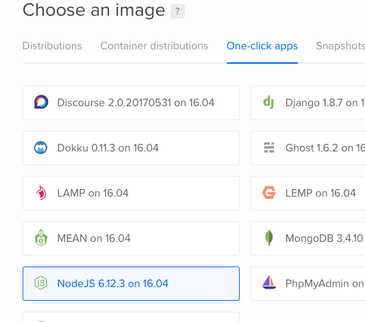

# NoobHub Installer and CLI

A NoobHub Installer for the DigitalOcean NodeJS Droplet

## DigitalOcean

_These instructions assume you know how to use the [DigitalOcean](https://m.do.co/c/cddeeddbbdb8) control panel._

Select __Create__ -> __Droplets__.

Select the __NodeJS__ choice under the __One-click apps__ section.

  

Continue with the rest of the set up and then __Create__.

## Installation

_After your droplet is done spinning up..._

Log in with your `root` user:

```sh
ssh root@your-droplet-ip
```

Grab the installation directory from GitHub.

```sh
git clone https://github.com/develephant/noobhub-install.git
```

On the command line do the followng:

```sh
cd noobhub-install
```

```sh
./install.sh
```

Watch along, and you should be all set!

## Corona Usage

Download the NoobHub package, and look in the __clients__ directory for a __[Corona](https://coronalabs.com/)__ specific example.

__[Click here to download NoobHub.](https://github.com/Overtorment/NoobHub/archive/master.zip)__


### Free Hosting Credit

Not a DigitalOcean member? __[Click here for $10 hosting credit](https://m.do.co/c/cddeeddbbdb8)__.

### Notes

___Installer and CLI by C. Byerley (https://develephant.com)___

__[NoobHub Support Forum](http://forums.coronalabs.com/topic/32775-noobhub-free-opensource-multiplayer-and-network-messaging-for-coronasdk)__ 

__[NoobHub on GitHub](https://github.com/Overtorment/NoobHub)__ (give it a :star:)